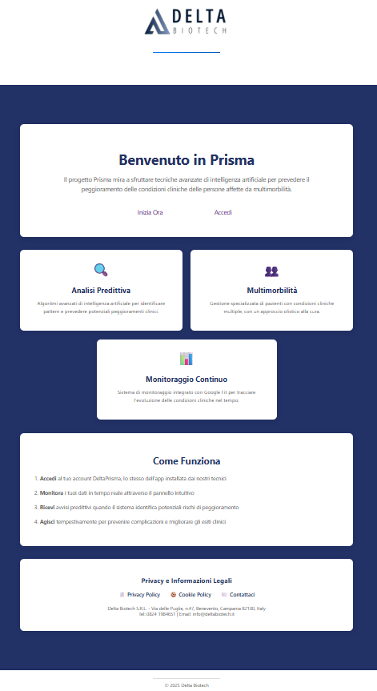
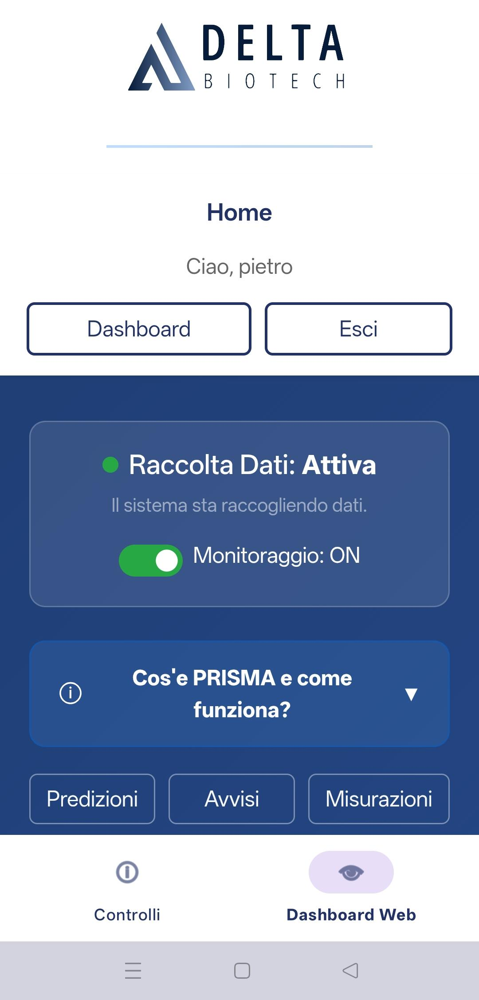
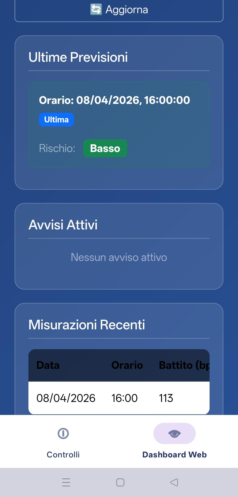
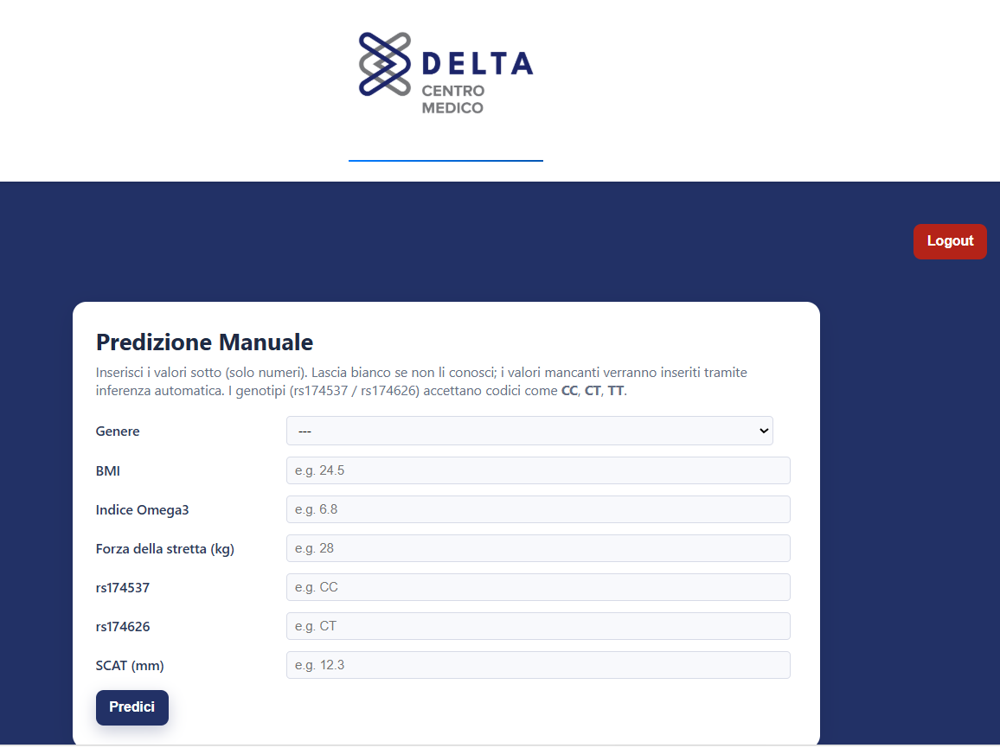
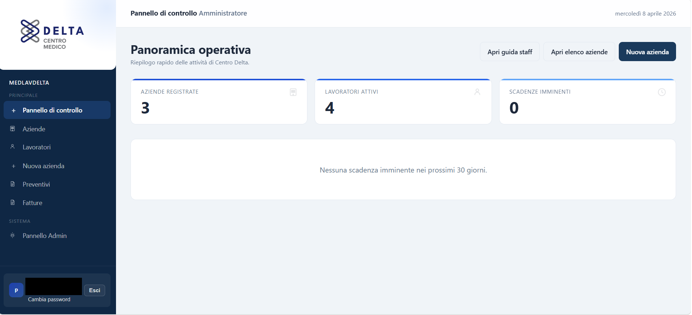

# Pietrangelo Manco

AI/ML engineer and full-stack developer building health tech, predictive systems, and production-ready applications.

  
  
  
  

  <a href="https://github.com/PietrangeloManco">GitHub</a> |
  <a href="https://deltaprisma.it/">DeltaPrisma</a> |
  <a href="https://play.google.com/store/apps/details?id=com.pietro.healthconnectmonitor&hl=it">DeltaPrisma App</a> |
  <a href="https://omnipredict.it/">Omnipredict</a> |
  <a href="https://medlavdelta.it/">MedLavDelta</a>

## About me

- MSc in Artificial Intelligence and Data Engineering, University of Pisa
- BSc in Physics, University of Pisa
- AI/ML full-stack developer at Centro Delta
- Based in Pisa, Italy
- Interested in applied machine learning, deep learning, product integration, and real deployment workflows

## What I Build

- predictive systems that move from research to production
- full-stack web products for health-related use cases
- ML-backed interfaces designed around real operational workflows
- end-to-end projects spanning data, modelling, backend, frontend, and deployment

## Selected work

- [Prisma_IDE](https://github.com/PietrangeloManco/Prisma_IDE)  
  Remote-monitoring platform designed to anticipate clinical deterioration through a web platform, a companion Android app, and wearable-driven data collection.

- [Omnipredict_IDE](https://github.com/PietrangeloManco/Omnipredict_IDE)  
  Sarcopenia prediction platform built around a deployed classifier and a production-ready web workflow.

- [MedLavDelta_IDE](https://github.com/PietrangeloManco/MedLavDelta_IDE)  
  Management platform for occupational medicine workflows used in the context of Centro Delta.

- [ObjectDetectionUnlearning](https://github.com/PietrangeloManco/ObjectDetectionUnlearning)  
  Public companion repository for my master's thesis on machine unlearning for object detection, focused on privacy-oriented forgetting and correction-oriented unlearning workflows.

- [MIRCV-Project](https://github.com/PietrangeloManco/MIRCV-Project)  
  Search engine project focused on scalable multimedia information retrieval and large document collections.

- [GameGram](https://github.com/PietrangeloManco/GameGram)  
  Java desktop social network built with a multi-database architecture based on Neo4j and MongoDB.

- [LaptopPricePrediction](https://github.com/PietrangeloManco/LaptopPricePrediction)  
  Data mining and machine learning project for predicting laptop price ranges from hardware specifications.

## Live products

- [DeltaPrisma web platform](https://deltaprisma.it/)
- [DeltaPrisma Android app](https://play.google.com/store/apps/details?id=com.pietro.healthconnectmonitor&hl=it)
- [Omnipredict](https://omnipredict.it/)
- [MedLavDelta](https://medlavdelta.it/)

## Product previews

### Prisma

<table>
  <tr>
    <th align="center" width="33%">Web platform</th>
    <th align="center" width="33%">Monitoring app</th>
    <th align="center" width="33%">Prediction dashboard</th>
  </tr>
  <tr>
    <td align="center" width="33%">
      
    </td>
    <td align="center" width="33%">
      
    </td>
    <td align="center" width="33%">
      
    </td>
  </tr>
  <tr>
    <td align="center">Landing and access flow.</td>
    <td align="center">Monitoring state and app entry point.</td>
    <td align="center">Predictions, alerts, and measurements.</td>
  </tr>
</table>

### Omnipredict and MedLavDelta

<table>
  <tr>
    <th align="center" width="50%">Omnipredict</th>
    <th align="center" width="50%">MedLavDelta</th>
  </tr>
  <tr>
    <td align="center" width="50%">
      
    </td>
    <td align="center" width="50%">
      
    </td>
  </tr>
  <tr>
    <td align="center">Manual sarcopenia prediction flow.</td>
    <td align="center">Operational dashboard with redacted business data.</td>
  </tr>
</table>

## Contact

- GitHub: [github.com/PietrangeloManco](https://github.com/PietrangeloManco)
- LinkedIn: [linkedin.com/in/pietrangelomanco](https://www.linkedin.com/in/pietrangelomanco/)
- Email: `pietrangelo.manco26@gmail.com`
