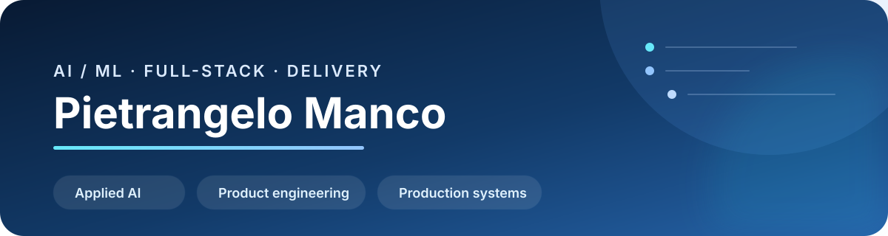

  

  
<strong>AI/ML engineer and full-stack developer turning research and operational problems into dependable products.</strong>

  

    MSc in Artificial Intelligence &amp; Data Engineering, University of Pisa · BSc in Physics · Based in Italy
  

  

    <a href="https://www.linkedin.com/in/pietrangelomanco/">LinkedIn</a> ·
    <a href="mailto:pietrangelo.manco26@gmail.com">Email</a> ·
    <a href="https://github.com/PietrangeloManco/ObjectDetectionUnlearning">Featured research</a>
  

## Featured work

### Machine unlearning for object detection

`PUBLIC RESEARCH` · `COMPUTER VISION` · `PRIVACY`

My MSc thesis reframed machine unlearning for structured object-detection outputs, with separate privacy-driven deletion and correction-oriented scenarios. The public companion explains the experimental design, evaluation strategy, and research conclusions without releasing supervised research code, datasets, or checkpoints.

[Explore the case study →](https://github.com/PietrangeloManco/ObjectDetectionUnlearning)

---

### Applied monitoring and risk workflows

`PRIVATE PRODUCT SOURCE` · `PUBLIC WORKFLOW NOTES`

I build end-to-end ML products that connect data preparation, model inference, user-facing review, and deployment:

- **DeltaPrisma** — wearable-assisted longitudinal monitoring across a Django platform and an Android companion app. [Workflow notebook](notebooks/Prisma_Public_Workflow.ipynb) · [Web platform](https://deltaprisma.it/) · [Android app](https://play.google.com/store/apps/details?id=com.pietro.healthconnectmonitor&hl=it)
- **Omnipredict** — a research-to-product risk-assessment workflow with a private model and web application. [Workflow notebook](notebooks/Omnipredict_Public_Workflow.ipynb) · [Live product](https://omnipredict.it/)

The notebooks document architecture and reasoning with placeholders; they do not contain patient-level data, proprietary features, model weights, or production integration details.

---

### Operational platforms for healthcare teams

`PRIVATE EMPLOYER WORK` · `SANITIZED SHOWCASE`

I design and maintain Django systems for appointment handling, laboratory and occupational workflows, planning, inventory, reporting, and role-aware team operations. Current deployments include [My Centro Delta](https://mycentrodelta.com/), [Delta Biotech Platform](https://deltabiotechpharma.it/), and [MedLavDelta](https://medlavdelta.it/).

[View the independent synthetic case study →](https://github.com/PietrangeloManco/healthcare-operations-platform-showcase)

---

### Editorial intelligence and production assurance

`PRIVATE CLIENT WORK` · `PUBLIC-SAFE PATTERNS`

- **[Banknotes.eu](https://www.banknotes.eu/)** — a bilingual Astro/MDX editorial platform built around structured, source-led content and responsive delivery.
- **Search visibility monitoring** — a private Django workflow combining browser automation, structured observations, and assisted analysis for repeatable monitoring.
- **CMS change assurance** — guarded automation for inventory, deterministic snapshots, planned changes, cache alignment, and evidence-based verification.
- **Production reliability** — watchdog, recovery, and verification patterns for containerized imaging infrastructure, without exposing production topology or access details.

[Explore the synthetic CMS assurance lab →](https://github.com/PietrangeloManco/wordpress-change-assurance-lab)

## Technical focus

**Applied AI:** PyTorch, scikit-learn, evaluation design, privacy-aware ML · **Product:** Python, Django, REST APIs, TypeScript, Astro, Android/Kotlin · **Delivery:** PostgreSQL, Docker, Linux, CI, browser automation, observability

<strong>Earlier systems and academic projects</strong>

 

- [MIRCV-Project](https://github.com/PietrangeloManco/MIRCV-Project) — compressed indexing, BM25/TF-IDF retrieval, and large-collection search.
- [GameGram](https://github.com/PietrangeloManco/GameGram) — Java/JavaFX social application using MongoDB and Neo4j.
- [LaptopPricePrediction](https://github.com/PietrangeloManco/LaptopPricePrediction) — notebook-based data preparation, modelling, and evaluation for price-range prediction.

## Public/private boundary

Production repositories for employer and client work stay private. Public companions are created from scratch with synthetic data, independently authored illustrative code, and reviewed visuals; they exclude production history, credentials, personal or business data, model weights, private datasets, infrastructure details, and client-specific logic.

## Contact

[LinkedIn](https://www.linkedin.com/in/pietrangelomanco/) · [pietrangelo.manco26@gmail.com](mailto:pietrangelo.manco26@gmail.com)
